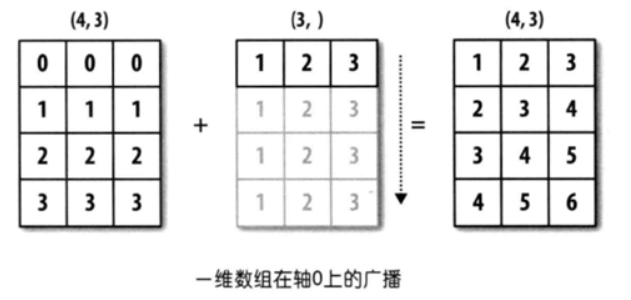

# python broadcast

python中两个ndarray执行element-wise运算时，两个ndarray的维度并不相同的时候，可以通过扩展数组的方法来实现相加、相减、相乘等操作，这就是broadcast机制。注意区分element-wise运算和矩阵的运算，矩阵运算需要维度之间的严格匹配。

## 广播原则

广播的原则：如果两个数组的后缘维度（trailing dimension，即从末尾开始算起的维度）的轴长度相符，或其中的一方的长度为1，则认为它们是广播兼容的。广播会在缺失和（或）长度为1的维度上进行。

 这句话乃是理解广播的核心。广播主要发生在两种情况，一种是两个数组的维数不相等，但是它们的后缘维度的轴长相符，另外一种是有一方的长度为1。

### 数组维度不同，后缘维度的轴长相符

```text
import numpy as np

arr1 = np.array([[0, 0, 0],[1, 1, 1],[2, 2, 2], [3, 3, 3]])  #arr1.shape = (4,3)
arr2 = np.array([1, 2, 3])    #arr2.shape = (3,)
arr_sum = arr1 + arr2
print(arr_sum)

输入结果如下:
'''
[[1 2 3]
 [2 3 4]
 [3 4 5]
 [4 5 6]]
'''
```

上例中arr1的shape为\(4, 3\)，arr2的shape为\(3, \)。可以说前者是二维的，而后者是一维的。但是它们的后缘维度相等，arr1的第二维长度为3，和arr2的维度相同。arr1和arr2的shape并不一样，但是它们可以执行相加操作，这就是通过广播完成的，在这个例子当中是将arr2沿着0轴进行扩展。

上面程序当中的广播如下图所示：



同样的例子还有：


从上面的图可以看到，\(3, 4, 2\)和\(4, 2\)的维度是不相同的，前者为3维，后者为2维。但是它们后缘维度的轴长相同，都为\(4, 2\)，所以可以沿着0轴进行广播。

 同样，还有一些例子：\(4, 2, 3\)和\(2, 3\)是兼容的，\(4, 2, 3\)还和\(3, \)是兼容的，后者需要在两个轴上面进行扩展。

### 数组维度相同，其中有个轴为1

```text
import numpy as np

arr1 = np.array([[0, 0, 0],[1, 1, 1],[2, 2, 2], [3, 3, 3]])  #arr1.shape = (4,3)
arr2 = np.array([[1],[2],[3],[4]])    #arr2.shape = (4, 1)

arr_sum = arr1 + arr2
print(arr_sum)

输出结果如下：
[[1 1 1]
 [3 3 3]
 [5 5 5]
 [7 7 7]]
```

arr1的shape为\(4, 3\)，arr2的shape为\(4, 1\)，它们都是二维的，但是第二个数组在1轴上的长度为1，所以，可以在1轴上面进行广播，如下图所示：


在这种情况下，两个数组的维度要保证相等，其中有一个轴的长度为1，这样就会沿着长度为1的轴进行扩展。这样的例子还有：\(4, 6\)和\(1, 6\) ，\(3, 5, 6\)和\(1, 5, 6\)，\(3, 1, 6\)、\(3, 5, 1\)，后面三个分别会沿着0轴，1轴，2轴进行广播。

## 参考资料

[https://www.cnblogs.com/jiaxin359/p/9021726.html](https://www.cnblogs.com/jiaxin359/p/9021726.html)

